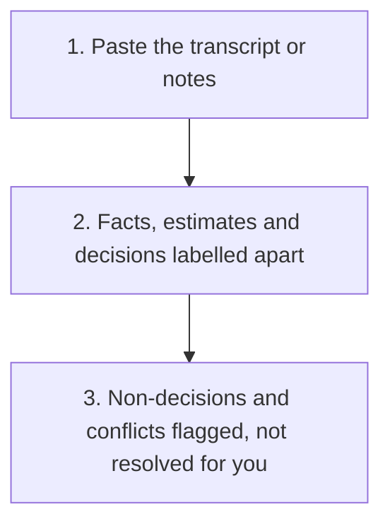

# Evidence-Labelled Meeting Notes

  
  

Turn a meeting transcript or notes into a write-up that keeps confirmed facts, estimates and assumptions visibly separate, so nothing invented gets treated as agreed.

## Why

A meeting write-up usually reads as one flat block of "what happened," which quietly lets a proposal that was never actually agreed read the same as a real decision, or an action nobody was assigned read as if someone owns it. This keeps those things visibly apart: what was actually confirmed, what is an estimate, what is second-hand, and what only sounds like a decision but was left open.

## Use It

Copy [SKILL.md](SKILL.md) and paste it into your AI tool (ChatGPT, Claude, Gemini, or similar), then paste in the meeting's transcript or your notes. It produces:

- **Confirmed facts**, kept separate from estimates and second-hand reports
- **Flagged non-decisions**, anything discussed that sounded like an agreement but was not actually confirmed as one
- **An action list**, with owner and timing marked as unknown whenever the meeting did not actually assign them, rather than guessed
- **Open questions**, what the meeting genuinely left unresolved

<strong>See exactly what it produces</strong>

1. A labelled list of confirmed facts, estimates, second-hand reports, inferences, unknowns and conflicts
2. Real decisions stated plainly as decisions, alongside anything flagged as a non-decision rather than confirmed
3. An action list with owner and timing marked unknown wherever the meeting did not actually assign them
4. Open questions the meeting genuinely left unresolved, with the points a reader must check before relying on the write-up

See [the output template](templates/output-template.md) for the exact shape without any fictional content, or the worked examples for it run against real transcripts. [The first](example/) is a project status call built with traps that should not be mistaken for decisions (a proposal floated but never agreed, an action acknowledged but never assigned, a fact one speaker got wrong and then corrected). [The second](example-two/) tests the opposite risk, a hiring debrief with genuine, confirmed decisions the skill needs to correctly recognise rather than hedge out of excess caution.

Use [the review checklist](checks/checklist.md) before treating any write-up as the record.

No installation, project, or coding required to try it once.

## Before You Use It

Do not paste in anything confidential you are not allowed to process outside your organisation's approved tools. This produces a write-up for your own use; treat any suggested next step as something to check and act on yourself, not something the write-up has already authorised.

## Licence

MIT.

## Feedback

Tried it on a real meeting? [Start a discussion](https://github.com/shaunmarsden/evidence-labelled-meeting-notes/discussions) if something did not work the way you expected.

## Part of a Family

This is one of a family of free tools generalising [practical-ai-sales-workflows](https://github.com/shaunmarsden/practical-ai-sales-workflows) patterns beyond sales. See [sibling-projects](https://github.com/shaunmarsden/sibling-projects) for the rest, or use [the router](https://github.com/shaunmarsden/sibling-projects/blob/main/ROUTER.md) if you are not sure which one actually fits.
